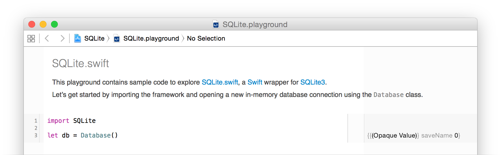
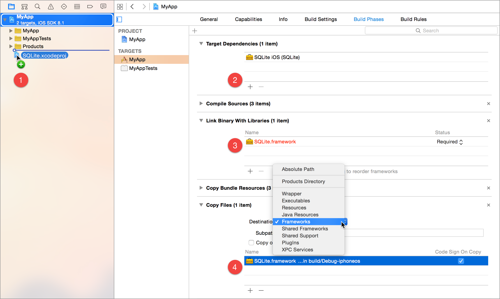

# SQLite.swift

![Build Status][GitHubActionBadge] [![CocoaPods Version][CocoaPodsVersionBadge]][CocoaPodsVersionLink] [![Swift5 compatible][Swift5Badge]][Swift5Link] [![Platform][PlatformBadge]][PlatformLink] [![Carthage compatible][CartagheBadge]][CarthageLink] [![Join the chat at https://gitter.im/stephencelis/SQLite.swift][GitterBadge]][GitterLink]

A type-safe, [Swift][]-language layer over [SQLite3][].

[SQLite.swift][] provides compile-time confidence in SQL statement
syntax _and_ intent.

## Features

 - A pure-Swift interface
 - A type-safe, optional-aware SQL expression builder
 - A flexible, chainable, lazy-executing query layer
 - Automatically-typed data access
 - A lightweight, uncomplicated query and parameter binding interface
 - Developer-friendly error handling and debugging
 - [Full-text search][] support
 - [Well-documented][See Documentation]
 - Extensively tested
 - [SQLCipher][] support via CocoaPods
 - Works on [Linux](Documentation/Linux.md) (with some limitations)
 - Active support at
   [StackOverflow](https://stackoverflow.com/questions/tagged/sqlite.swift),
   and [Gitter Chat Room](https://gitter.im/stephencelis/SQLite.swift)
   (_experimental_)

[SQLCipher]: https://www.zetetic.net/sqlcipher/
[Full-text search]: Documentation/Index.md#full-text-search
[See Documentation]: Documentation/Index.md#sqliteswift-documentation


## Usage

```swift
import SQLite

// Wrap everything in a do...catch to handle errors
do {
    let db = try Connection("path/to/db.sqlite3")

    let users = Table("users")
    let id = Expression<Int64>("id")
    let name = Expression<String?>("name")
    let email = Expression<String>("email")

    try db.run(users.create { t in
        t.column(id, primaryKey: true)
        t.column(name)
        t.column(email, unique: true)
    })
    // CREATE TABLE "users" (
    //     "id" INTEGER PRIMARY KEY NOT NULL,
    //     "name" TEXT,
    //     "email" TEXT NOT NULL UNIQUE
    // )

    let insert = users.insert(name <- "Alice", email <- "alice@mac.com")
    let rowid = try db.run(insert)
    // INSERT INTO "users" ("name", "email") VALUES ('Alice', 'alice@mac.com')

    for user in try db.prepare(users) {
        print("id: \(user[id]), name: \(user[name]), email: \(user[email])")
        // id: 1, name: Optional("Alice"), email: alice@mac.com
    }
    // SELECT * FROM "users"

    let alice = users.filter(id == rowid)

    try db.run(alice.update(email <- email.replace("mac.com", with: "me.com")))
    // UPDATE "users" SET "email" = replace("email", 'mac.com', 'me.com')
    // WHERE ("id" = 1)

    try db.run(alice.delete())
    // DELETE FROM "users" WHERE ("id" = 1)

    try db.scalar(users.count) // 0
    // SELECT count(*) FROM "users"
} catch {
    print (error)
}
```

SQLite.swift also works as a lightweight, Swift-friendly wrapper over the C
API.

```swift
// Wrap everything in a do...catch to handle errors
do {
    // ...
    
    let stmt = try db.prepare("INSERT INTO users (email) VALUES (?)")
    for email in ["betty@icloud.com", "cathy@icloud.com"] {
        try stmt.run(email)
    }

    db.totalChanges    // 3
    db.changes         // 1
    db.lastInsertRowid // 3

    for row in try db.prepare("SELECT id, email FROM users") {
        print("id: \(row[0]), email: \(row[1])")
        // id: Optional(2), email: Optional("betty@icloud.com")
        // id: Optional(3), email: Optional("cathy@icloud.com")
    }

    try db.scalar("SELECT count(*) FROM users") // 2
} catch {
    print (error)
}
```

[Read the documentation][See Documentation] or explore more,
interactively, from the Xcode project’s playground.



For a more comprehensive example, see
[this article][Create a Data Access Layer with SQLite.swift and Swift 2]
and the [companion repository][SQLiteDataAccessLayer2].


[Create a Data Access Layer with SQLite.swift and Swift 2]: https://masteringswift.blogspot.com/2015/09/create-data-access-layer-with.html
[SQLiteDataAccessLayer2]: https://github.com/hoffmanjon/SQLiteDataAccessLayer2/tree/master

## Installation

> _Note:_ Version 0.11.6 and later requires Swift 5 (and [Xcode](https://developer.apple.com/xcode/downloads/) 10.2) or greater. Version 0.11.5 requires Swift 4.2 (and [Xcode](https://developer.apple.com/xcode/downloads/) 10.1) or greater.

### Swift Package Manager

The [Swift Package Manager][] is a tool for managing the distribution of
Swift code.

1. Add the following to your `Package.swift` file:

  ```swift
  dependencies: [
      .package(url: "https://github.com/stephencelis/SQLite.swift.git", from: "0.13.3")
  ]
  ```

2. Build your project:

  ```sh
  $ swift build
  ```

See the [Tests/SPM](https://github.com/stephencelis/SQLite.swift/tree/master/Tests/SPM) folder for a small demo project which uses SPM.

[Swift Package Manager]: https://swift.org/package-manager

### Carthage

[Carthage][] is a simple, decentralized dependency manager for Cocoa. To
install SQLite.swift with Carthage:

 1. Make sure Carthage is [installed][Carthage Installation].

 2. Update your Cartfile to include the following:

    ```ruby
    github "stephencelis/SQLite.swift" ~> 0.13.3
    ```

 3. Run `carthage update` and
    [add the appropriate framework][Carthage Usage].


[Carthage]: https://github.com/Carthage/Carthage
[Carthage Installation]: https://github.com/Carthage/Carthage#installing-carthage
[Carthage Usage]: https://github.com/Carthage/Carthage#adding-frameworks-to-an-application


### CocoaPods

[CocoaPods][] is a dependency manager for Cocoa projects. To install
SQLite.swift with CocoaPods:

 1. Make sure CocoaPods is [installed][CocoaPods Installation].

    ```sh
    # Using the default Ruby install will require you to use sudo when
    # installing and updating gems.
    [sudo] gem install cocoapods
    ```

 2. Update your Podfile to include the following:

    ```ruby
    use_frameworks!

    target 'YourAppTargetName' do
        pod 'SQLite.swift', '~> 0.13.3'
    end
    ```

 3. Run `pod install --repo-update`.

[CocoaPods]: https://cocoapods.org
[CocoaPods Installation]: https://guides.cocoapods.org/using/getting-started.html#getting-started

### Manual

To install SQLite.swift as an Xcode sub-project:

 1. Drag the **SQLite.xcodeproj** file into your own project.
    ([Submodule][], clone, or [download][] the project first.)

    

 2. In your target’s **General** tab, click the **+** button under **Linked
    Frameworks and Libraries**.

 3. Select the appropriate **SQLite.framework** for your platform.

 4. **Add**.

Some additional steps are required to install the application on an actual
device:

 5. In the **General** tab, click the **+** button under **Embedded
    Binaries**.

 6. Select the appropriate **SQLite.framework** for your platform.

 7. **Add**.


[Xcode]: https://developer.apple.com/xcode/downloads/
[Submodule]: https://git-scm.com/book/en/Git-Tools-Submodules
[download]: https://github.com/stephencelis/SQLite.swift/archive/master.zip


## Communication

[See the planning document] for a roadmap and existing feature requests.

[Read the contributing guidelines][]. The _TL;DR_ (but please; _R_):

 - Need **help** or have a **general question**? [Ask on Stack
   Overflow][] (tag `sqlite.swift`).
 - Found a **bug** or have a **feature request**? [Open an issue][].
 - Want to **contribute**? [Submit a pull request][].

[See the planning document]: /Documentation/Planning.md
[Read the contributing guidelines]: ./CONTRIBUTING.md#contributing
[Ask on Stack Overflow]: https://stackoverflow.com/questions/tagged/sqlite.swift
[Open an issue]: https://github.com/stephencelis/SQLite.swift/issues/new
[Submit a pull request]: https://github.com/stephencelis/SQLite.swift/fork


## Author

 - [Stephen Celis](mailto:stephen@stephencelis.com)
   ([@stephencelis](https://twitter.com/stephencelis))


## License

SQLite.swift is available under the MIT license. See [the LICENSE
file](./LICENSE.txt) for more information.

## Related

These projects enhance or use SQLite.swift:

 - [SQLiteMigrationManager.swift][] (inspired by
   [FMDBMigrationManager][])
 - [Delta: Math helper](https://apps.apple.com/app/delta-math-helper/id1436506800)
   (see [Delta/Utils/Database.swift](https://github.com/GroupeMINASTE/Delta-iOS/blob/master/Delta/Utils/Database.swift) for production implementation example)


## Alternatives

Looking for something else? Try another Swift wrapper (or [FMDB][]):

 - [Camembert](https://github.com/remirobert/Camembert)
 - [GRDB](https://github.com/groue/GRDB.swift)
 - [SQLiteDB](https://github.com/FahimF/SQLiteDB)
 - [Squeal](https://github.com/nerdyc/Squeal)
 - [SwiftData](https://github.com/ryanfowler/SwiftData)

[Swift]: https://swift.org/
[SQLite3]: https://www.sqlite.org
[SQLite.swift]: https://github.com/stephencelis/SQLite.swift

[GitHubActionBadge]: https://img.shields.io/github/workflow/status/stephencelis/SQLite.swift/Build%20and%20test

[CocoaPodsVersionBadge]: https://cocoapod-badges.herokuapp.com/v/SQLite.swift/badge.png
[CocoaPodsVersionLink]: https://cocoapods.org/pods/SQLite.swift

[PlatformBadge]: https://cocoapod-badges.herokuapp.com/p/SQLite.swift/badge.png
[PlatformLink]: https://cocoapods.org/pods/SQLite.swift

[CartagheBadge]: https://img.shields.io/badge/Carthage-compatible-4BC51D.svg?style=flat
[CarthageLink]: https://github.com/Carthage/Carthage

[GitterBadge]: https://badges.gitter.im/stephencelis/SQLite.swift.svg
[GitterLink]: https://gitter.im/stephencelis/SQLite.swift

[Swift5Badge]: https://img.shields.io/badge/swift-5-orange.svg?style=flat
[Swift5Link]: https://developer.apple.com/swift/

[SQLiteMigrationManager.swift]: https://github.com/garriguv/SQLiteMigrationManager.swift
[FMDB]: https://github.com/ccgus/fmdb
[FMDBMigrationManager]: https://github.com/layerhq/FMDBMigrationManager
